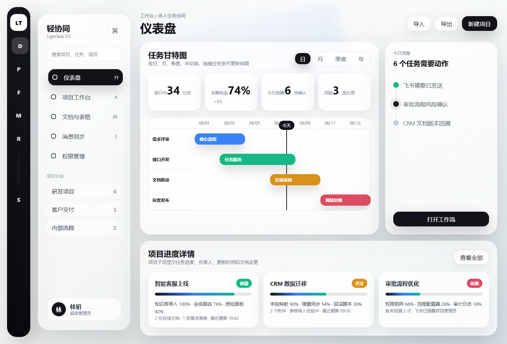
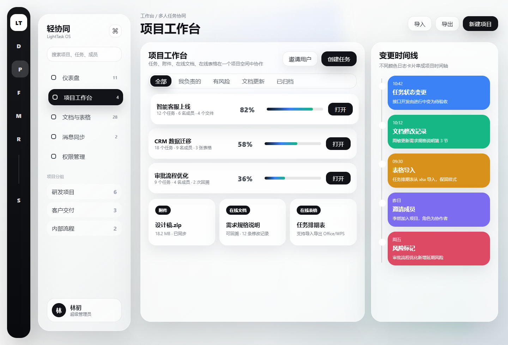
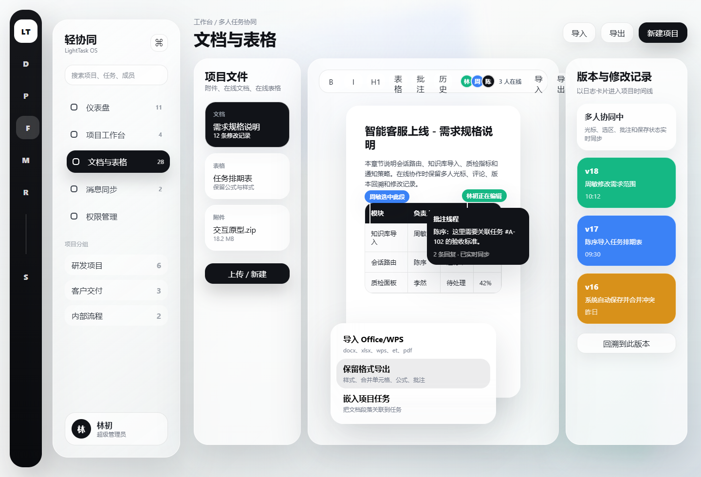
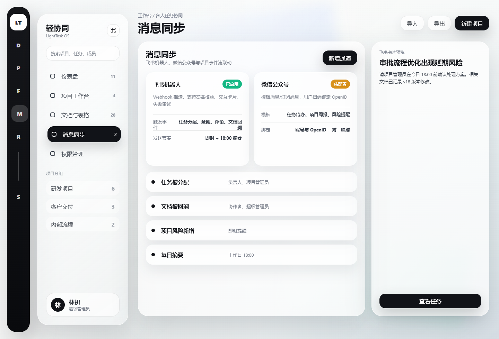
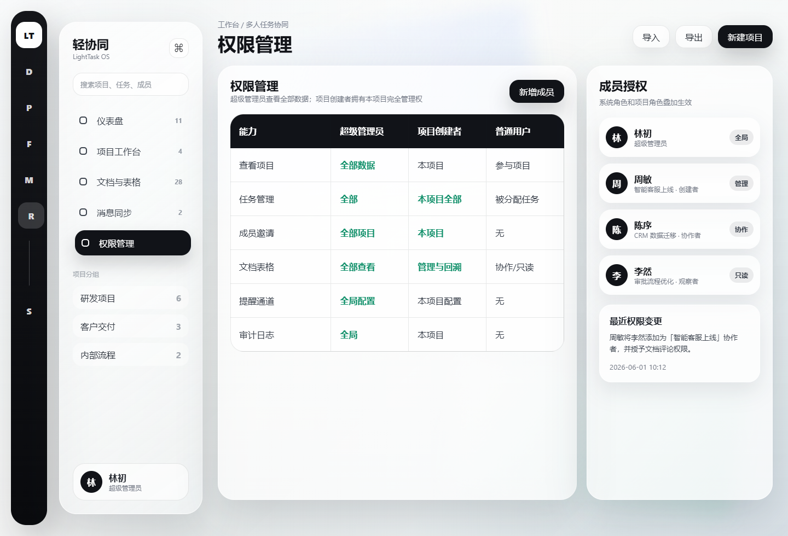
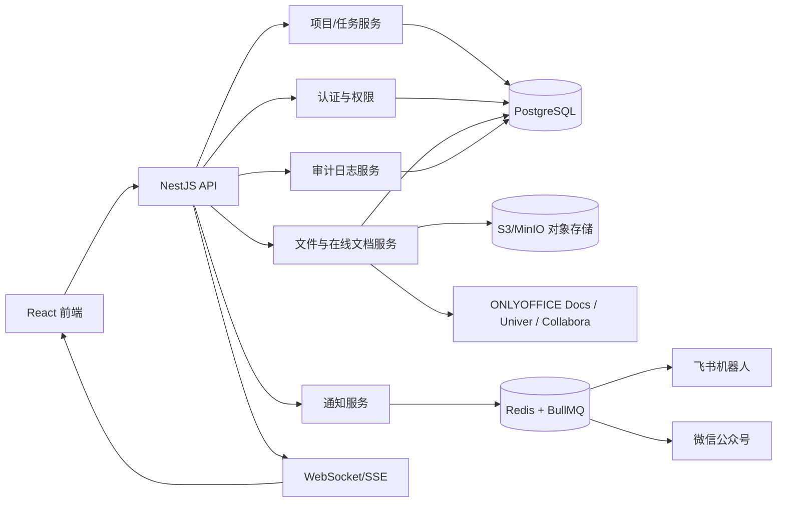

# 轻量级多人任务协同系统开发文档 v2

版本：v0.2  
日期：2026-06-01  
更新重点：前端改为参考图风格的玻璃拟态后台体验，新增项目附件、在线文档、在线表格、导入导出、版本回溯与修改记录日志。

## 1. 产品目标

系统面向 5-100 人团队，用一个轻量工作台承载项目、任务、文档、表格、附件、时间线和消息提醒。产品不追求重型项目管理软件的复杂配置，而是把“任务推进”和“协作痕迹”做得清楚、流畅、可追溯。

核心目标：

- 在仪表盘看到日、月、季度、年的任务甘特图和项目进度。
- 在项目列表中创建任务、邀请成员、管理附件、在线文档和在线表格。
- 用彩色日志卡片把项目变更、任务变更、文档修改、表格导入、风险事件串成时间线。
- 接入飞书机器人和微信公众号提醒。
- 清晰区分超级管理员、普通用户、项目创建者和项目成员权限。
- 在线编辑流程不卡顿，导入导出尽量保留 Office/WPS 格式、公式、样式、批注和合并单元格。

## 2. 视觉与交互方向

参考图风格关键词：

- 黑色窄图标栏：左侧主导航使用纯黑高对比图标栏，强化产品识别。
- 半透明侧栏：二级导航使用奶白玻璃材质，轻阴影和背景模糊。
- 柔和大面板：主工作区以大圆角玻璃面板组织信息，边界轻、阴影软。
- 黑色主操作：主要按钮和选中态使用黑色胶囊按钮，形成清晰焦点。
- 浮层菜单：导入、导出、分享、嵌入工具等操作使用轻浮层承载。
- 流畅动效：页面切换、侧栏展开、卡片进入、时间线新增、甘特图拖动都使用 200-450ms 的缓动。

动效原则：

| 场景 | 动效建议 | 时长 |
| --- | --- | --- |
| 页面切换 | 淡入 + 轻微上移归位 | 360-500ms |
| 侧栏展开/收起 | 宽度过渡 + 内容透明度过渡 | 280-360ms |
| 浮层菜单出现 | 缩放 0.96 到 1 + 透明度 | 180-240ms |
| 时间线新增日志 | 从右侧 16px 滑入 + 高亮 1 次 | 300-450ms |
| 甘特条拖动 | 位置跟手，释放后吸附日期网格 | 即时 + 180ms |
| 在线编辑保存 | 顶部状态轻提示，不打断编辑 | 120-200ms |

## 3. 系统效果图

### 3.1 仪表盘

页面能力：

- 日、月、季度、年维度切换甘特图。
- 甘特图展示任务条、今日线和状态颜色。
- 下方展示项目进度详情，包含子任务进度、附件和文档变更摘要。
- 右侧今日流程卡片聚合待处理动作。

### 3.2 项目工作台与变更时间线

页面能力：

- 创建任务、邀请用户。
- 项目列表展示任务数量、成员数量、文件数量和进度。
- 项目可添加附件、在线文档和在线表格。
- 时间线用不同颜色展示任务、文档、表格、成员和风险日志。

### 3.3 在线文档与表格

页面能力：

- 项目文件区统一管理附件、文档和表格。
- 在线文档支持协作编辑、评论、修改记录、版本回溯。
- 在线表格支持公式、样式、筛选、冻结、合并单元格等常用能力。
- 支持导入和导出 Office/WPS 常见格式，并尽量保留样式和结构。

### 3.4 消息同步

页面能力：

- 飞书机器人 Webhook 配置。
- 微信公众号模板消息/订阅消息配置。
- 任务、风险、评论、文档回溯等事件可触发提醒。
- 支持即时提醒、每日摘要和失败重试。

### 3.5 权限管理

页面能力：

- 超级管理员、项目创建者、普通用户权限矩阵。
- 成员系统角色和项目角色叠加显示。
- 权限变更进入审计日志。

## 4. 角色与权限

| 角色 | 作用范围 | 权限摘要 |
| --- | --- | --- |
| 超级管理员 | 全局 | 查看全部数据，管理全部项目、用户、权限、提醒通道和审计日志 |
| 普通用户 | 自己参与范围 | 创建项目，查看参与项目，处理被分配任务，参与文档协作 |
| 项目创建者 | 自建项目 | 拥有本项目完全管理权，可邀请成员、管理任务、文件、提醒规则和项目日志 |
| 项目协作者 | 被邀请项目 | 查看项目，创建/编辑被授权任务，参与文档和表格协作 |
| 项目观察者 | 被邀请项目 | 只读查看项目、任务、甘特图、文件和时间线 |

权限矩阵：

| 能力 | 超级管理员 | 项目创建者 | 项目协作者 | 项目观察者 | 普通用户 |
| --- | --- | --- | --- | --- | --- |
| 查看项目 | 全部项目 | 本项目 | 参与项目 | 参与项目 | 参与项目 |
| 创建项目 | 允许 | 允许 | 允许 | 允许 | 允许 |
| 删除项目 | 任意项目 | 自建项目 | 无 | 无 | 自建项目 |
| 邀请成员 | 任意项目 | 本项目 | 无 | 无 | 自建项目 |
| 创建任务 | 任意项目 | 本项目 | 被授权项目 | 无 | 自建项目 |
| 编辑任务 | 任意任务 | 本项目任务 | 被分配任务 | 无 | 被分配任务 |
| 管理附件 | 任意项目 | 本项目 | 上传/编辑被授权附件 | 只读 | 自建项目 |
| 管理在线文档 | 任意项目 | 本项目管理与回溯 | 协作/评论 | 只读 | 自建项目 |
| 管理在线表格 | 任意项目 | 本项目管理与回溯 | 协作/评论 | 只读 | 自建项目 |
| 配置提醒通道 | 全局和项目 | 本项目 | 无 | 无 | 自建项目 |
| 查看审计日志 | 全部 | 本项目 | 仅可见参与项目变更 | 只读可见 | 自建项目 |

## 5. 推荐技术架构

### 5.1 总体架构

### 5.2 技术栈

| 层级 | 推荐 | 说明 |
| --- | --- | --- |
| 前端 | React 18 + TypeScript + Vite | 适合快速搭建高交互后台 |
| UI | Tailwind CSS + Radix UI 或 Ant Design 二次封装 | 便于实现玻璃拟态、浮层、抽屉和复杂表单 |
| 动效 | Framer Motion | 页面切换、浮层、卡片进入、列表重排 |
| 甘特图 | 自研 SVG/Canvas 甘特图 | MVP 更容易控制日/月/季度/年视图 |
| 后端 | NestJS + TypeScript | 模块化、鉴权、队列、WebSocket 生态成熟 |
| ORM | Prisma | 类型安全，迁移清晰 |
| 数据库 | PostgreSQL | 项目、任务、权限、日志结构化存储 |
| 缓存/队列 | Redis + BullMQ | 提醒队列、失败重试、摘要任务 |
| 文件存储 | MinIO 或 S3 | 附件、源文件、导出文件、版本快照 |
| 在线 Office | ONLYOFFICE Docs 优先，Univer/Collabora 备选 | 兼顾 Office/WPS 兼容和二次开发 |
| 协同编辑 | Yjs/CRDT 或编辑器内置协同能力 | 实现类石墨文档的多人光标、选区、评论、实时保存 |

## 6. 在线文档与表格方案

### 6.1 推荐方案

MVP 推荐优先集成 ONLYOFFICE Docs：

- 它提供文档、表格、演示、表单等编辑能力，并可集成到 Web 应用中提供编辑、协作和共享能力。
- 对 docx、xlsx、pptx 这类 Office 主流格式兼容性通常优于从零自研。
- 后端只需实现文件存储、鉴权、回调、版本快照和审计日志。

备选方案：

| 方案 | 适合场景 | 取舍 |
| --- | --- | --- |
| ONLYOFFICE Docs | 需要较好的 Office/WPS 格式兼容、完整文档和表格编辑 | 服务较重，但上线快 |
| Collabora Online | 偏 LibreOffice/WOPI 生态，重视开源办公套件能力 | 集成需要 WOPI Host，部署和伸缩需关注粘性路由 |
| Univer | 希望做深度自定义表格/文档交互、前端嵌入轻、界面可控 | 高级协同、导入导出等能力需确认版本和授权 |

### 6.2 文件与编辑流程

1. 用户在项目内上传 docx、xlsx、pptx、wps、et、pdf 等文件。
2. 后端保存源文件到对象存储，写入 project_files。
3. 若文件可在线编辑，创建 office_sessions。
4. 前端通过编辑器 iframe 或 SDK 打开文件。
5. 编辑器保存后回调后端。
6. 后端生成新版本快照，写入 file_versions。
7. 生成 audit_logs，事件组为 document 或 spreadsheet。
8. 时间线展示“文档修改记录”“表格导入”“版本回溯”等彩色日志卡片。

### 6.3 导入导出要求

导入：

- 支持 docx、xlsx、pptx、wps、et、csv、pdf。
- xlsx 导入需尽量保留公式、合并单元格、冻结行列、筛选、样式、批注。
- docx 导入需尽量保留标题层级、表格、图片、页眉页脚、批注和修订痕迹。
- 导入后生成一条项目日志，记录文件名、格式、操作者和转换结果。

导出：

- 文档导出 docx、pdf。
- 表格导出 xlsx、csv、pdf。
- 导出文件保留样式、公式、合并单元格、批注和工作表结构。
- 导出任务进入队列，完成后给操作者发送站内通知，必要时发送飞书或微信提醒。

### 6.4 类石墨文档多人协同体验

在线编辑目标体验对齐石墨文档这类协同产品：多人同时进入同一份文档或表格时，编辑过程实时可见，评论和修改记录可以回溯，保存过程不打断用户输入。

前端体验：

- 多人在线头像：编辑器顶部展示当前在线成员头像、姓名和在线状态。
- 实时光标和选区：不同用户使用不同颜色显示光标、选中文本、选中单元格。
- 实时编辑：用户输入、删除、格式变更、单元格编辑在其他成员侧低延迟同步。
- 评论与批注：支持段落评论、单元格评论、评论回复、解决评论。
- 修改记录：展示谁在什么时间修改了哪些段落、单元格、标题或附件。
- 自动保存：编辑中显示“已保存 / 保存中 / 离线待同步”，不弹窗打断。
- 离线容错：短暂断网时本地保留操作队列，恢复后自动同步。
- 版本回溯：可查看历史版本、对比版本、恢复版本，恢复后生成新的版本记录。

协同技术策略：

- 文档正文和表格结构使用编辑器内置协同能力或 CRDT/OT 层同步。
- 若采用 ONLYOFFICE Docs，优先使用其协作编辑、保存回调和版本能力，系统负责权限、文件版本、项目日志和消息提醒。
- 若采用自研前端编辑体验，可用 Yjs/CRDT 管理实时操作，WebSocket 负责同步更新，PostgreSQL/S3 保存快照。
- 对于在线表格，公式计算、合并单元格、筛选、冻结、样式和批注必须纳入协同数据模型或交给 Office 引擎处理。
- 所有协同操作按批次落库为版本快照，关键操作写入 audit_logs。

性能指标：

- 打开文档首屏目标小于 2 秒，超过 2 秒显示骨架屏。
- 普通文本输入端到端同步目标小于 300ms。
- 表格单元格编辑端到端同步目标小于 500ms。
- 自动保存间隔 15-30 秒，焦点离开、导出、关闭页面前强制保存。
- 单文档 20 人同时在线可稳定协作，MVP 至少保障 10 人同时在线。

### 6.5 协作体验要求

- 编辑操作本地立即响应，保存状态在顶部轻提示，不打断输入。
- 多人在线时展示成员头像、光标位置、选区、当前编辑段落或单元格。
- 冲突处理优先由 Office 引擎或协同引擎完成，系统保存版本快照和审计日志。
- 每 15-30 秒自动保存一次，关键操作立即保存。
- 支持版本对比、版本恢复和恢复后生成新版本。

## 7. 核心功能设计

### 7.1 仪表盘

功能：

- 时间维度：日、月、季度、年。
- 甘特图展示任务起止时间、状态、负责人和今日线。
- 甘特条支持拖拽改期，释放后吸附日期网格。
- 下方展示项目进度详情与子任务进度。
- 右侧今日流程聚合待处理任务、风险确认、文档回溯提醒。

计算规则：

- 项目完成率 = 已完成任务权重 / 全部任务权重。
- 计划进度 = 当前日期在项目周期中的位置。
- 健康：无延期任务，实际进度不低于计划进度 10%。
- 关注：存在即将到期任务，或实际进度落后计划 10%-25%。
- 延期：存在已过期未完成任务，或进度落后计划超过 25%。

### 7.2 项目工作台

功能：

- 创建项目、创建任务、邀请用户。
- 按全部、我负责的、有风险、文档更新、已归档筛选。
- 项目卡片展示任务数、成员数、附件数、进度和风险状态。
- 项目内统一管理任务、成员、附件、在线文档、在线表格和时间线。
- 附件支持上传、下载、预览、替换、删除和权限控制。

### 7.3 变更时间线

日志类型：

| 类型 | 颜色 | 示例 |
| --- | --- | --- |
| task | 蓝色 | 任务创建、状态变更、负责人变更、截止日期变更 |
| member | 紫色 | 邀请成员、角色调整、移除成员 |
| progress | 绿色 | 项目进度、任务进度更新 |
| risk | 红色 | 延期、阻塞、风险解除 |
| document | 绿色 | 文档编辑、评论、版本恢复、导出 |
| spreadsheet | 橙色 | 表格导入、公式修改、工作表新增 |
| attachment | 灰色 | 附件上传、替换、删除 |
| notification | 蓝灰色 | 飞书/微信提醒发送成功、失败、重试 |

所有日志卡片字段：

- 操作者。
- 事件类型。
- 事件标题。
- 变更摘要。
- before_snapshot。
- after_snapshot。
- 关联项目、任务、文件。
- 创建时间。

### 7.4 消息同步

飞书机器人：

- 配置 Webhook URL、签名密钥、启用状态和项目范围。
- 支持任务卡片、风险卡片、文档修改卡片、每日摘要卡片。
- 发送失败后进入队列重试 3 次。

微信公众号：

- 配置 AppID、AppSecret、模板 ID、Token、EncodingAESKey。
- 用户扫码绑定系统账号与 OpenID。
- 支持任务待办、项目周报、风险提醒、文档回溯提醒。

提醒规则：

- 任务被分配：提醒负责人和项目管理员。
- 任务即将到期：提前 24 小时提醒负责人。
- 项目风险新增：提醒项目创建者和超级管理员。
- 文档被回溯：提醒协作者、项目创建者和超级管理员。
- 每日摘要：工作日 18:00 汇总发送。

### 7.5 权限管理

实现要点：

- 所有写接口后端校验权限，前端只控制展示。
- 项目创建者不能移除自己，转让项目后才能退出。
- 在线文档和表格权限继承项目权限，但支持文件级只读、评论、编辑、管理。
- 超级管理员可查看全部数据，但操作必须写入审计日志。
- 普通用户创建项目后，自动拥有该项目完全管理权。

## 8. 数据模型

主要表：

| 表 | 说明 |
| --- | --- |
| users | 用户账号 |
| projects | 项目 |
| project_members | 项目成员和项目级角色 |
| tasks | 任务 |
| task_assignees | 任务负责人和协作者 |
| project_files | 项目附件、在线文档、在线表格 |
| file_versions | 文件版本快照 |
| file_permissions | 文件级权限 |
| office_sessions | 在线编辑会话 |
| collaboration_sessions | 多人协同会话 |
| collaboration_operations | 协同编辑操作流，可按需冷热分层 |
| audit_logs | 项目、任务、文件、权限、通知日志 |
| notification_channels | 通知通道 |
| notification_rules | 提醒规则 |
| notification_jobs | 队列任务 |
| notification_logs | 通知发送结果 |
| user_wechat_bindings | 用户与微信 OpenID 绑定 |

project_files：

- id
- project_id
- type：attachment、document、spreadsheet、presentation、pdf
- name
- storage_key
- mime_type
- size
- editable
- current_version_id
- created_by
- created_at
- updated_at
- deleted_at

file_versions：

- id
- file_id
- version_no
- storage_key
- editor_snapshot_key
- change_summary
- created_by
- created_at
- restored_from_version_id

office_sessions：

- id
- file_id
- user_id
- provider：onlyoffice、collabora、univer
- mode：view、edit、comment
- session_token
- status：active、closed、expired
- opened_at
- closed_at

collaboration_sessions：

- id
- file_id
- provider：onlyoffice、collabora、univer、yjs
- status：active、closed
- online_user_count
- last_synced_at
- created_at
- updated_at

collaboration_operations：

- id
- session_id
- file_id
- user_id
- operation_type：insert_text、delete_text、format_text、update_cell、comment、resolve_comment
- operation_payload
- client_seq
- server_seq
- created_at

说明：如果使用 ONLYOFFICE/Collabora 的成熟协同能力，系统不一定需要保存完整 operation 流，可只保存版本快照、评论摘要和 audit_logs。若采用自研 CRDT/Yjs 协同，则需要保存 operation 或 CRDT update，用于断线恢复、增量同步和问题排查。

audit_logs：

- id
- project_id
- task_id
- file_id
- actor_id
- event_group
- event_type
- title
- message
- before_snapshot
- after_snapshot
- created_at

## 9. 接口设计

### 9.1 仪表盘

| 方法 | 路径 | 说明 |
| --- | --- | --- |
| GET | /api/dashboard/summary | 获取项目、任务、风险统计 |
| GET | /api/dashboard/gantt?scope=day | 获取甘特图数据 |
| GET | /api/dashboard/project-progress | 获取项目进度详情 |
| PATCH | /api/tasks/:id/schedule | 拖拽甘特条后更新任务排期 |

### 9.2 项目与任务

| 方法 | 路径 | 说明 |
| --- | --- | --- |
| GET | /api/projects | 项目列表 |
| POST | /api/projects | 创建项目 |
| GET | /api/projects/:id | 项目详情 |
| PATCH | /api/projects/:id | 编辑项目 |
| POST | /api/projects/:id/members | 邀请项目成员 |
| PATCH | /api/projects/:id/members/:userId | 修改项目角色 |
| DELETE | /api/projects/:id/members/:userId | 移除项目成员 |
| GET | /api/projects/:id/tasks | 任务列表 |
| POST | /api/projects/:id/tasks | 创建任务 |
| PATCH | /api/tasks/:id | 编辑任务 |
| POST | /api/tasks/:id/comments | 新增评论 |

### 9.3 文件、文档与表格

| 方法 | 路径 | 说明 |
| --- | --- | --- |
| GET | /api/projects/:id/files | 项目文件列表 |
| POST | /api/projects/:id/files/upload | 上传附件或 Office 文件 |
| POST | /api/projects/:id/files/create | 新建在线文档或在线表格 |
| GET | /api/files/:id | 文件详情 |
| DELETE | /api/files/:id | 删除文件 |
| POST | /api/files/:id/open | 创建在线编辑会话 |
| GET | /api/files/:id/collaboration/session | 获取协同会话状态 |
| WS | /ws/collaboration/:fileId | 多人光标、选区、评论和操作同步 |
| POST | /api/files/:id/export | 导出 docx/xlsx/pdf/csv |
| POST | /api/files/:id/import | 导入并转换文件 |
| GET | /api/files/:id/versions | 文件版本列表 |
| POST | /api/files/:id/versions/:versionId/restore | 回溯到指定版本 |
| GET | /api/files/:id/permissions | 文件权限 |
| PATCH | /api/files/:id/permissions | 修改文件权限 |
| POST | /api/office/onlyoffice/callback | ONLYOFFICE 保存回调 |
| POST | /api/office/collabora/wopi/files/:id | WOPI 文件接口 |

### 9.4 时间线与审计

| 方法 | 路径 | 说明 |
| --- | --- | --- |
| GET | /api/projects/:id/timeline | 项目时间线 |
| GET | /api/tasks/:id/timeline | 任务时间线 |
| GET | /api/files/:id/timeline | 文件时间线 |
| GET | /api/admin/audit-logs | 超级管理员查看全局审计 |

### 9.5 消息同步

| 方法 | 路径 | 说明 |
| --- | --- | --- |
| GET | /api/notification/channels | 通道列表 |
| POST | /api/notification/channels | 创建通道 |
| PATCH | /api/notification/channels/:id | 修改通道 |
| POST | /api/notification/channels/:id/test | 发送测试消息 |
| GET | /api/notification/rules | 提醒规则 |
| POST | /api/notification/rules | 创建提醒规则 |
| PATCH | /api/notification/rules/:id | 修改提醒规则 |
| GET | /api/notification/logs | 通知日志 |
| POST | /api/wechat/bind/qrcode | 生成微信绑定二维码 |
| POST | /api/wechat/callback | 微信公众号回调 |

## 10. 关键流程

### 10.1 创建项目

1. 用户填写项目名称、描述、起止日期。
2. 后端创建项目，owner_id 为当前用户。
3. 写入 project_members，当前用户为 owner。
4. 写入 audit_logs：project.created。
5. 跳转项目工作台。

### 10.2 上传附件或创建在线文档

1. 用户在项目文件区上传文件或新建文档。
2. 后端校验项目权限。
3. 文件进入对象存储。
4. 写入 project_files 和 file_versions。
5. 若为可编辑格式，创建编辑器可打开的文件配置。
6. 写入 audit_logs：file.created 或 file.uploaded。
7. 项目时间线展示文件日志卡片。

### 10.3 在线编辑与版本回溯

1. 用户打开文件，后端生成 office_session。
2. 编辑器加载文档。
3. 用户编辑后编辑器回调后端保存。
4. 后端生成 file_versions。
5. 写入 audit_logs：document.updated 或 spreadsheet.updated。
6. 用户选择历史版本恢复时，系统复制旧版本为新版本。
7. 写入 audit_logs：document.restored，并触发提醒规则。

### 10.4 表格导入导出

1. 用户上传 xlsx/et/csv。
2. 后端调用 Office/转换服务导入为在线表格。
3. 校验转换结果，记录导入报告。
4. 用户编辑后可导出 xlsx/csv/pdf。
5. 导出任务进入队列，完成后生成下载地址。
6. 导入和导出均写入时间线。

### 10.5 消息提醒

1. 业务事件产生 audit_log。
2. 通知服务根据 notification_rules 匹配规则。
3. 生成 notification_jobs。
4. Worker 调用飞书或微信公众号。
5. 成功或失败写入 notification_logs。
6. 失败按指数退避重试。

## 11. 前端路由

| 路由 | 页面 |
| --- | --- |
| /dashboard | 仪表盘 |
| /projects | 项目工作台 |
| /projects/:id | 项目详情 |
| /projects/:id/tasks/:taskId | 任务详情 |
| /projects/:id/files | 项目文件 |
| /projects/:id/files/:fileId | 在线文档/表格编辑 |
| /projects/:id/timeline | 项目时间线 |
| /notifications | 消息同步 |
| /permissions | 权限管理 |
| /admin/audit-logs | 全局审计日志 |

## 12. 性能与体验要求

前端：

- 首屏 JS 按路由拆包。
- 甘特图虚拟渲染任务条，超过 200 条任务时只渲染可视区域。
- 时间线分页加载，新增事件实时插入。
- 在线文档 iframe 或编辑器 SDK 与主系统隔离，避免拖慢主页面。
- 所有浮层菜单支持键盘操作和焦点管理。

后端：

- 文件上传走分片上传，支持断点续传。
- 导入导出走异步队列，避免阻塞接口。
- 大文件预览和下载走对象存储签名 URL。
- 审计日志写入使用事务或事件 outbox，避免业务成功但日志丢失。
- 通知队列幂等，防止重复发送。

## 13. 安全要求

- 密码使用 argon2id 或 bcrypt。
- 登录态使用 HttpOnly Cookie 或短期 Access Token + Refresh Token。
- 文件下载和在线编辑会话使用短期签名。
- Office 回调校验 token 和来源。
- 飞书签名校验，微信公众号回调验签。
- 通知通道配置加密存储。
- 超级管理员所有操作写入审计日志。
- 文件级权限和项目级权限都由后端最终校验。

## 14. 测试计划

单元测试：

- 权限判断。
- 项目进度计算。
- 甘特图时间范围转换。
- 审计日志 diff。
- 通知规则匹配。
- 文件版本回溯。

接口测试：

- 普通用户无法查看未参与项目。
- 项目创建者可以管理本项目任务、文件、提醒规则。
- 超级管理员可查看全部数据。
- 文档保存回调可生成版本和时间线。
- 表格导入导出任务能进入队列并生成日志。
- 通知失败后能重试。

端到端测试：

- 创建项目、创建任务、邀请成员。
- 上传 docx/xlsx 并在线打开。
- 编辑文档后查看版本记录和项目时间线。
- 回溯文档版本并触发飞书提醒。
- 导出 xlsx，检查公式、样式、合并单元格。
- 权限变更后普通成员只能看到授权文件。

## 15. MVP 里程碑

第 1 周：基础工程

- 前后端工程初始化。
- 用户登录、系统角色、项目角色。
- 项目、任务、成员数据模型。

第 2 周：项目任务与仪表盘

- 项目工作台。
- 任务 CRUD。
- 甘特图日/月/季度/年视图。
- 项目进度详情。

第 3 周：文件与在线编辑

- 附件上传下载。
- ONLYOFFICE Docs 或备选编辑器集成。
- 文档/表格打开、保存回调、版本记录。
- 导入导出队列。

第 4 周：时间线与消息同步

- 项目和任务时间线。
- 文档/表格日志卡片。
- 飞书机器人提醒。
- 微信公众号提醒基础链路。

第 5 周：权限、测试与部署

- 权限管理页。
- 文件级权限。
- 端到端测试。
- Docker Compose 部署。
- 监控和日志。

## 16. 参考资料

- ONLYOFFICE API：<https://api.onlyoffice.com/>
- ONLYOFFICE WOPI 集成说明：<https://api.onlyoffice.com/docs/docs-api/using-wopi/overview/>
- Univer 官方文档：<https://docs.univer.ai/>
- Univer 协同编辑说明：<https://docs.univer.ai/guides/sheets/features/collaboration>
- Collabora Online 文档入口：<https://www.collaboraoffice.org/docs/>
- Collabora Online 集成说明：<https://www.collaboraonline.com/integrate-collabora-online/>
