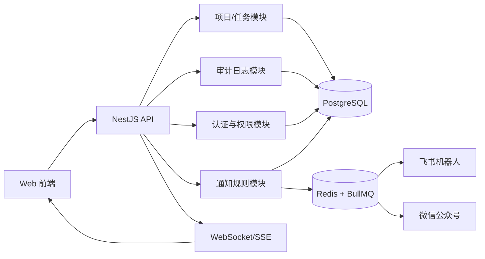
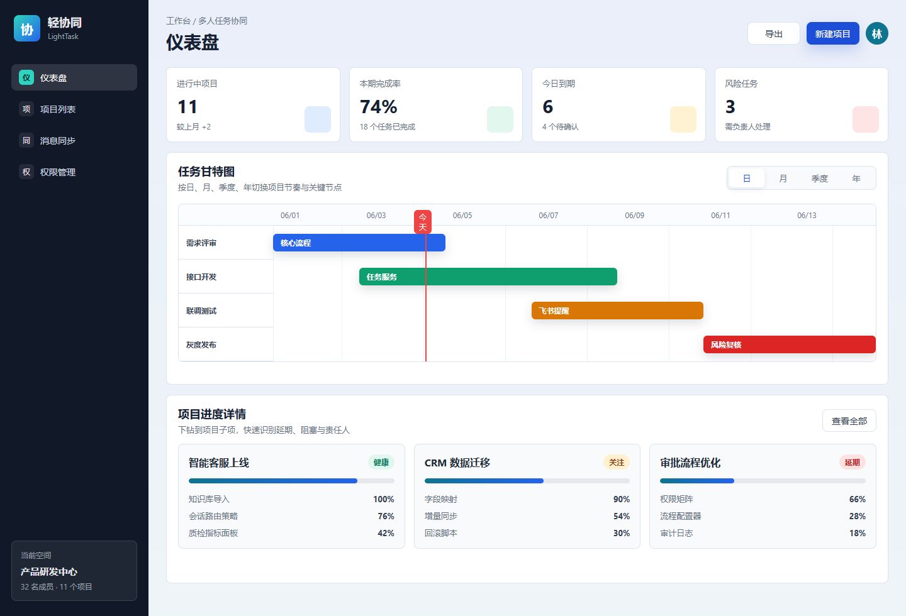
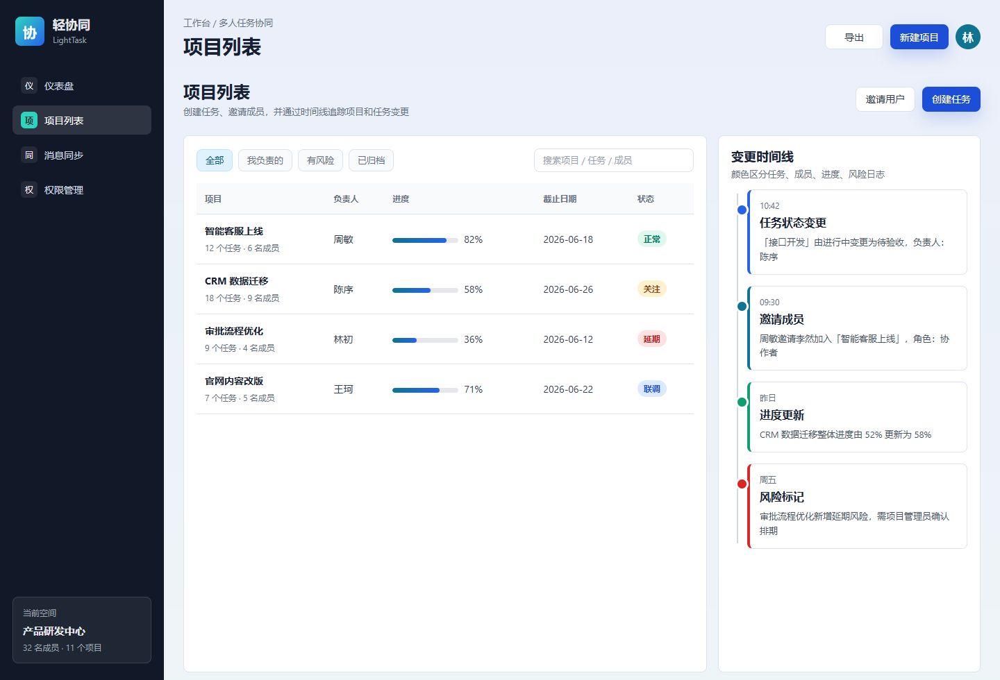
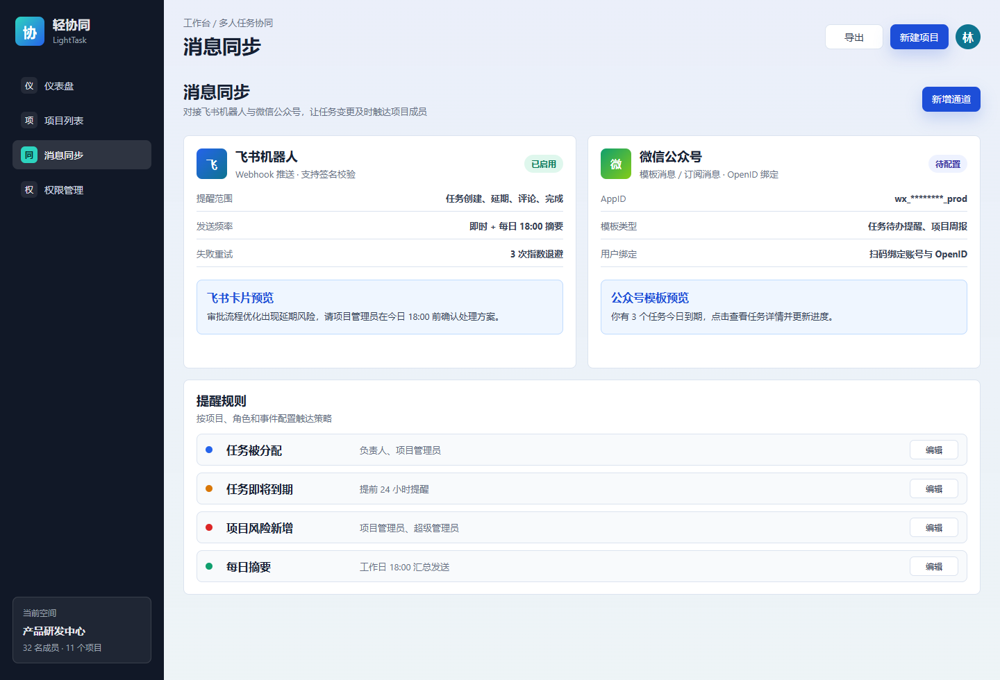
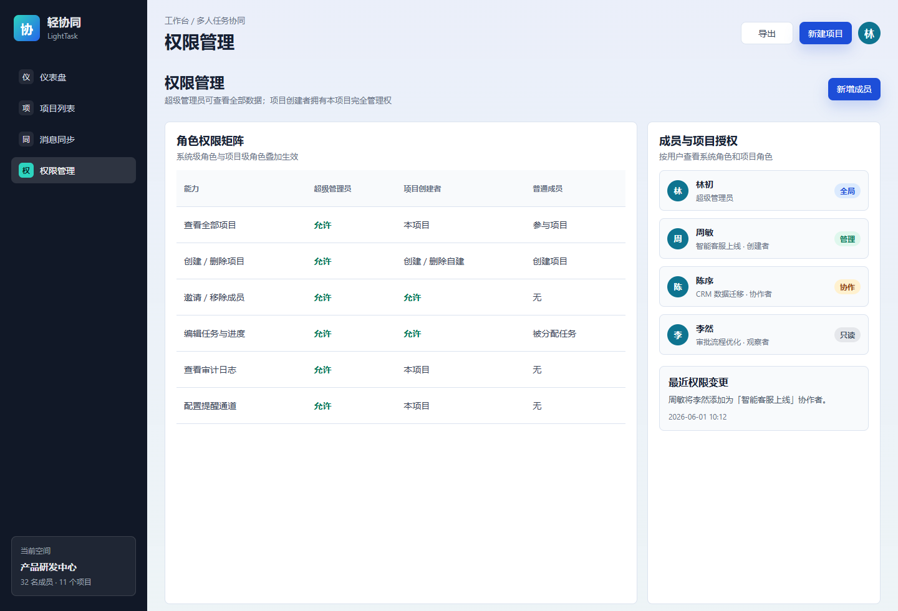

# 轻量级多人任务协同系统开发文档

版本：v0.1  
日期：2026-06-01  
目标：先完成一个可快速上线的 MVP，覆盖项目、任务、甘特图、变更时间线、消息提醒和基础权限管理。

## 1. 产品定位

本系统面向 5-100 人的小型团队或部门，用于跟踪多人协同项目中的任务进度、负责人、排期、变更记录和消息提醒。产品重点不是复杂项目管理，而是让团队成员能快速知道：

- 当前有哪些项目和任务正在进行。
- 每个项目是否按计划推进。
- 谁修改了项目、任务、进度和成员。
- 哪些任务需要通过飞书或微信公众号提醒。
- 超级管理员、项目创建者、普通用户分别能做什么。

## 2. 用户角色

| 角色 | 作用范围 | 核心能力 |
| --- | --- | --- |
| 超级管理员 | 全局 | 查看全部数据、管理全部项目、配置系统消息通道、查看全部审计日志、管理用户角色 |
| 普通用户 | 个人参与范围 | 创建项目、查看参与项目、处理被分配任务、评论任务、查看参与项目时间线 |
| 项目创建者 | 自建项目 | 拥有该项目完整管理权，包括成员邀请、任务管理、项目设置、提醒规则、项目审计日志 |
| 项目协作者 | 被邀请项目 | 查看项目、创建或处理任务、评论、更新被授权任务进度 |
| 项目观察者 | 被邀请项目 | 只读查看项目、任务、甘特图和项目时间线 |

权限采用“系统级角色 + 项目级角色”叠加。超级管理员拥有全局最高权限；普通用户创建项目后，自动成为该项目的项目创建者。

## 3. 推荐技术栈

| 层级 | 技术 | 选择理由 |
| --- | --- | --- |
| 前端 | React 18 + TypeScript + Vite + Ant Design | 适合后台管理界面，开发快，组件成熟 |
| 甘特图 | 自研轻量 SVG/Canvas 视图，MVP 先 SVG | 日/月/季度/年视图可控，避免引入过重依赖 |
| 后端 | NestJS + TypeScript | 与前端统一语言，模块化、鉴权和任务调度生态成熟 |
| ORM | Prisma | 类型安全，便于快速迭代数据模型 |
| 数据库 | PostgreSQL | 适合结构化项目、任务、日志、权限数据 |
| 缓存/队列 | Redis + BullMQ | 消息提醒、失败重试、每日摘要任务 |
| 实时同步 | WebSocket 或 SSE | 项目变更、任务变更、消息发送结果可实时刷新 |
| 文件部署 | Docker Compose | MVP 可单机部署，后续可拆服务 |

MVP 也可以简化为单体服务：前端静态文件由 NestJS 托管，数据库 PostgreSQL，Redis 用于提醒队列和限流。

## 4. 系统架构

## 5. 页面设计预期图

> 图片由本地 HTML/CSS mockup 渲染导出，适合作为研发和设计对齐的第一版页面预期。

### 5.1 仪表盘

主要内容：

- 项目总览指标：进行中项目、本期完成率、今日到期、风险任务。
- 甘特图支持日、月、季度、年维度切换。
- 甘特图下方展示项目进度详情。
- 项目进度子项展示任务进度、状态和关键阻塞。

### 5.2 项目列表与变更时间线

主要内容：

- 创建任务和邀请用户入口。
- 项目列表展示负责人、进度、截止日期和状态。
- 右侧时间线展示项目变更和任务变更。
- 日志卡片用不同颜色标注：任务变更、成员变更、进度变更、风险变更。

### 5.3 消息同步

主要内容：

- 飞书机器人 Webhook 配置。
- 微信公众号模板消息或订阅消息配置。
- 支持按事件配置提醒规则。
- 发送失败进入队列重试，保留发送日志。

### 5.4 权限管理

主要内容：

- 展示超级管理员、项目创建者、普通成员的权限差异。
- 支持按成员查看系统角色和项目角色。
- 记录权限变更审计日志。

## 6. 核心功能说明

### 6.1 仪表盘

功能目标：让管理者和项目成员在一个页面判断当前项目健康度。

功能点：

- 时间维度筛选：日、月、季度、年。
- 甘特图任务条：按计划开始时间、结束时间绘制。
- 任务状态颜色：未开始、进行中、待验收、已完成、延期、阻塞。
- 今日线：在甘特图中标记当前日期。
- 项目进度详情：展示项目整体完成率、子任务完成率、负责人和风险标识。
- 点击甘特条：打开任务详情抽屉。
- 点击项目进度项：进入项目详情页。

计算规则：

- 项目完成率 = 已完成任务权重 / 全部任务权重。
- 默认任务权重为 1，可在任务详情中调整。
- 项目状态：
  - 健康：无延期任务，整体进度不低于计划进度 10%。
  - 关注：存在即将到期任务，或进度落后计划 10%-25%。
  - 延期：存在已过期未完成任务，或进度落后计划超过 25%。

### 6.2 项目列表

功能目标：提供项目入口、创建任务入口、邀请成员入口和变更历史入口。

功能点：

- 项目筛选：全部、我负责的、有风险、已归档。
- 项目搜索：项目名、任务名、成员名。
- 创建项目：项目名称、描述、开始日期、截止日期、默认可见范围。
- 创建任务：任务标题、描述、负责人、协作者、开始时间、截止时间、优先级、状态。
- 邀请用户：通过手机号、邮箱或内部用户 ID 邀请。
- 项目详情：任务列表、甘特图、成员、提醒规则、审计日志。

### 6.3 变更时间线

功能目标：可追溯项目和任务的关键变更。

记录事件：

- 项目创建、编辑、归档、恢复。
- 成员邀请、角色变更、移除。
- 任务创建、状态变更、负责人变更、截止日期变更。
- 任务进度变更、评论新增、附件新增。
- 风险标记、风险解除。
- 消息提醒发送成功、失败、重试。

日志颜色建议：

| 类型 | 颜色 | 示例 |
| --- | --- | --- |
| 任务变更 | 蓝色 | 状态、负责人、日期、优先级变更 |
| 成员变更 | 青色 | 邀请成员、移除成员、角色调整 |
| 进度变更 | 绿色 | 项目完成率、任务完成率更新 |
| 风险变更 | 红色 | 延期、阻塞、风险解除 |
| 通知事件 | 紫灰色 | 飞书或微信提醒发送结果 |

### 6.4 消息同步

功能目标：把关键项目事件同步到飞书机器人和微信公众号。

飞书机器人：

- 配置项：Webhook URL、签名密钥、启用状态、默认项目范围。
- 消息格式：飞书交互卡片，展示项目名、任务名、负责人、截止时间、操作按钮。
- 推送事件：任务分配、任务到期、任务延期、评论提及、项目风险新增、每日摘要。

微信公众号：

- 配置项：AppID、AppSecret、模板 ID、Token、EncodingAESKey。
- 用户绑定：系统用户扫码绑定微信 OpenID。
- 消息类型：模板消息或订阅消息。
- 推送事件：任务待办、任务到期、项目周报、风险提醒。

可靠性要求：

- 通知任务进入队列。
- 失败重试 3 次，采用指数退避。
- 写入通知发送日志。
- 对同一用户同一任务的高频变更做 1-5 分钟合并提醒，避免刷屏。

### 6.5 权限管理

功能目标：保证普通用户能自助创建和管理自己的项目，同时超级管理员能监管全部数据。

权限矩阵：

| 能力 | 超级管理员 | 项目创建者 | 项目协作者 | 项目观察者 | 普通用户 |
| --- | --- | --- | --- | --- | --- |
| 查看全部项目 | 是 | 否 | 否 | 否 | 否 |
| 查看参与项目 | 是 | 是 | 是 | 是 | 是 |
| 创建项目 | 是 | 是 | 是 | 是 | 是 |
| 删除任意项目 | 是 | 否 | 否 | 否 | 否 |
| 删除自建项目 | 是 | 是 | 否 | 否 | 否 |
| 邀请项目成员 | 是 | 是 | 否 | 否 | 否 |
| 移除项目成员 | 是 | 是 | 否 | 否 | 否 |
| 创建项目任务 | 是 | 是 | 是 | 否 | 仅自建项目 |
| 编辑任意任务 | 是 | 是 | 否 | 否 | 否 |
| 编辑被分配任务 | 是 | 是 | 是 | 否 | 是 |
| 查看审计日志 | 是 | 本项目 | 否 | 否 | 否 |
| 配置提醒通道 | 是 | 本项目 | 否 | 否 | 否 |

鉴权策略：

- 后端所有写操作必须做权限校验。
- 前端只做展示控制，不作为最终安全边界。
- 项目成员表中记录用户的项目级角色。
- 项目创建者不能移除自己；若需转让项目，必须先转让创建者身份。
- 超级管理员操作也进入审计日志。

## 7. 数据模型设计

### 7.1 主要实体

| 表 | 说明 |
| --- | --- |
| users | 用户账号 |
| organizations | 团队或空间，可选，MVP 可默认一个空间 |
| projects | 项目 |
| project_members | 项目成员和项目级角色 |
| tasks | 任务 |
| task_assignees | 任务负责人和协作者 |
| task_comments | 任务评论 |
| audit_logs | 项目和任务变更日志 |
| notification_channels | 飞书、微信公众号等通知通道 |
| notification_rules | 提醒规则 |
| notification_jobs | 通知发送任务 |
| notification_logs | 通知发送结果 |
| user_wechat_bindings | 用户与微信公众号 OpenID 绑定 |

### 7.2 核心字段

users：

- id
- name
- email
- phone
- password_hash
- system_role：super_admin、user
- status：active、disabled
- created_at
- updated_at

projects：

- id
- name
- description
- owner_id
- start_date
- due_date
- status：active、archived
- health_status：healthy、attention、delayed
- progress
- created_at
- updated_at

tasks：

- id
- project_id
- title
- description
- status：todo、doing、review、done、blocked
- priority：low、medium、high、urgent
- owner_id
- start_date
- due_date
- progress
- weight
- created_by
- created_at
- updated_at

audit_logs：

- id
- project_id
- task_id
- actor_id
- event_type
- event_group：task、member、progress、risk、notification、project
- before_snapshot
- after_snapshot
- message
- created_at

notification_channels：

- id
- project_id，可为空；为空代表全局通道
- type：feishu_bot、wechat_official_account
- name
- config_encrypted
- enabled
- created_by
- created_at
- updated_at

notification_rules：

- id
- project_id
- event_type
- channel_type
- recipient_scope：assignee、project_admin、project_members、super_admin
- throttle_minutes
- enabled

## 8. 接口设计

### 8.1 认证

| 方法 | 路径 | 说明 |
| --- | --- | --- |
| POST | /api/auth/login | 登录 |
| POST | /api/auth/logout | 退出 |
| GET | /api/auth/me | 当前用户 |

### 8.2 仪表盘

| 方法 | 路径 | 说明 |
| --- | --- | --- |
| GET | /api/dashboard/summary | 获取项目、任务、风险统计 |
| GET | /api/dashboard/gantt?scope=day | 获取甘特图数据 |
| GET | /api/dashboard/project-progress | 获取项目进度详情 |

### 8.3 项目与任务

| 方法 | 路径 | 说明 |
| --- | --- | --- |
| GET | /api/projects | 项目列表 |
| POST | /api/projects | 创建项目 |
| GET | /api/projects/:id | 项目详情 |
| PATCH | /api/projects/:id | 编辑项目 |
| POST | /api/projects/:id/archive | 归档项目 |
| POST | /api/projects/:id/members | 邀请项目成员 |
| PATCH | /api/projects/:id/members/:userId | 修改项目成员角色 |
| DELETE | /api/projects/:id/members/:userId | 移除项目成员 |
| GET | /api/projects/:id/tasks | 项目任务列表 |
| POST | /api/projects/:id/tasks | 创建任务 |
| GET | /api/tasks/:id | 任务详情 |
| PATCH | /api/tasks/:id | 编辑任务 |
| POST | /api/tasks/:id/comments | 新增评论 |

### 8.4 时间线与审计

| 方法 | 路径 | 说明 |
| --- | --- | --- |
| GET | /api/projects/:id/timeline | 项目变更时间线 |
| GET | /api/tasks/:id/timeline | 任务变更时间线 |
| GET | /api/admin/audit-logs | 超级管理员查看全部审计日志 |

### 8.5 消息同步

| 方法 | 路径 | 说明 |
| --- | --- | --- |
| GET | /api/notification/channels | 通道列表 |
| POST | /api/notification/channels | 创建通知通道 |
| PATCH | /api/notification/channels/:id | 修改通知通道 |
| POST | /api/notification/channels/:id/test | 发送测试消息 |
| GET | /api/notification/rules | 提醒规则列表 |
| POST | /api/notification/rules | 创建提醒规则 |
| PATCH | /api/notification/rules/:id | 修改提醒规则 |
| GET | /api/notification/logs | 通知发送日志 |
| POST | /api/wechat/bind/qrcode | 生成微信绑定二维码 |
| POST | /api/wechat/callback | 微信公众号回调 |

## 9. 前端路由

| 路由 | 页面 |
| --- | --- |
| /dashboard | 仪表盘 |
| /projects | 项目列表 |
| /projects/:id | 项目详情 |
| /projects/:id/tasks/:taskId | 任务详情 |
| /projects/:id/timeline | 项目时间线 |
| /notifications | 消息同步配置 |
| /permissions | 权限管理 |
| /admin/audit-logs | 全局审计日志，仅超级管理员 |

## 10. 关键业务流程

### 10.1 创建项目

1. 用户填写项目名称、描述、起止日期。
2. 后端创建项目，owner_id 设为当前用户。
3. 写入 project_members，当前用户角色为 owner。
4. 写入 audit_logs，事件类型为 project.created。
5. 前端跳转项目详情页。

### 10.2 邀请用户加入项目

1. 项目创建者或超级管理员输入用户信息。
2. 后端校验项目管理权限。
3. 若用户不存在，可创建待激活用户或发送邀请链接。
4. 写入 project_members。
5. 写入 audit_logs，事件类型为 member.invited。
6. 触发通知规则，发送飞书或微信提醒。

### 10.3 任务变更并记录时间线

1. 用户编辑任务状态、负责人、截止日期或进度。
2. 后端读取变更前快照。
3. 完成权限校验与数据写入。
4. 比较 before_snapshot 和 after_snapshot。
5. 写入 audit_logs。
6. 根据事件类型进入通知队列。
7. WebSocket/SSE 推送前端刷新。

### 10.4 消息提醒发送

1. 业务事件触发 notification_rules。
2. 根据规则生成 notification_jobs。
3. BullMQ worker 读取任务。
4. 调用飞书或微信公众号接口。
5. 成功或失败写入 notification_logs。
6. 失败任务按策略重试。

## 11. 安全与合规

- 密码使用 bcrypt 或 argon2id 哈希。
- 通知通道配置需要加密存储，例如 Webhook、AppSecret。
- 后端统一鉴权装饰器：系统级权限、项目级权限、任务级权限。
- 审计日志不可由普通业务接口删除。
- 接口写操作需要 CSRF 或 SameSite Cookie 策略，若使用 Bearer Token 则需要刷新机制。
- 微信回调和飞书签名必须验证。
- 超级管理员操作需要记录 actor_id、IP、user_agent。

## 12. 测试计划

单元测试：

- 权限判断函数。
- 项目进度计算。
- 甘特图时间范围转换。
- 审计日志 diff 生成。
- 通知规则匹配。

接口测试：

- 普通用户无法查看未参与项目。
- 项目创建者可邀请成员和配置本项目提醒。
- 超级管理员可查看全部项目和审计日志。
- 任务变更后生成正确时间线。
- 通知发送失败后进入重试。

端到端测试：

- 登录后创建项目、创建任务、邀请成员。
- 修改任务状态，在时间线看到对应日志。
- 配置飞书机器人，发送测试消息。
- 超级管理员进入权限管理页，调整用户角色。

## 13. MVP 里程碑

第 1 周：基础项目搭建

- 前后端工程初始化。
- 用户登录、基础 RBAC。
- 项目、任务、项目成员数据模型。

第 2 周：项目与任务核心功能

- 项目列表、项目详情、任务 CRUD。
- 项目邀请成员。
- 任务状态、进度、负责人、日期管理。

第 3 周：仪表盘与时间线

- 日/月/季度/年甘特图。
- 项目进度详情。
- 审计日志与时间线展示。

第 4 周：消息同步与权限管理

- 飞书机器人提醒。
- 微信公众号提醒基础链路。
- 权限管理页。
- 通知日志和重试。

第 5 周：联调、测试和部署

- 端到端测试。
- 权限边界测试。
- Docker Compose 部署。
- 生产配置和监控告警。

## 14. 后续增强

- 任务依赖关系和关键路径。
- 自定义字段和自定义任务状态。
- 文件附件和评论提及。
- 项目模板。
- 周报自动生成。
- 多组织、多租户隔离。
- 移动端 H5 页面。
- 企业微信、钉钉、邮件提醒。
