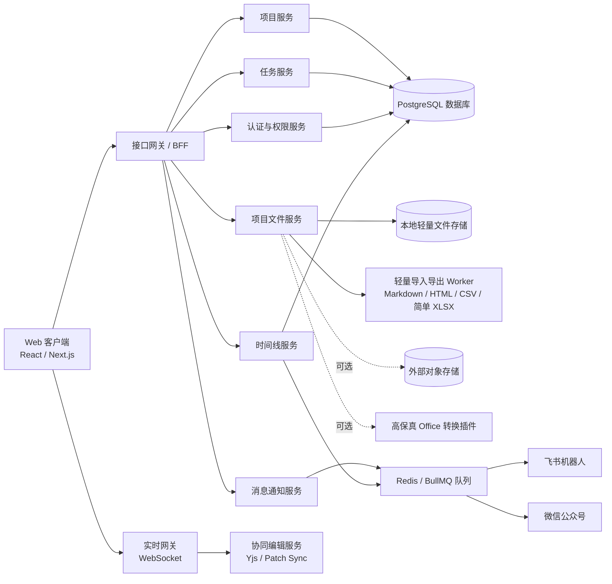

# LightTask v12 整体实现框架

## 总体架构



## VPS 配置预估

以下预估按 Docker Compose 或轻量容器部署计算，包含 Web/BFF、WebSocket、任务队列、PostgreSQL、Redis、轻量 Worker 和基础文件服务。v12 核心版新增成员级任务进度、计划快慢计算和任务提交物，但不包含表格转储、大批量数据迁移、本机高保真 Office 转换、复杂工时或绩效统计，因此仍可支持 2 核 2G 40G 的低配安装。

### 配置建议

| 场景 | 适用规模 | 推荐配置 | 说明 |
| --- | --- | --- | --- |
| 极简安装 | 1-5 人演示或轻量试用，少量项目 | 2 vCPU / 2GB RAM / 40GB SSD | 正式支持核心版安装；保留轻量文档/表格协同，关闭表格转储和高保真 Office 转换。 |
| 开发 / 演示 | 1-10 人测试，少量文档 | 2 vCPU / 4GB RAM / 60GB SSD | 可跑前后端、PostgreSQL、Redis 和轻量 Worker，体验更余裕。 |
| MVP 小团队 | 10-30 人，5-10 人同时在线协作 | 4 vCPU / 8GB RAM / 120GB NVMe SSD | 推荐起步配置，可承载项目、任务、时间线、消息和轻量文档协同。 |
| 小型生产 | 30-100 人，10-30 人同时协作 | 8 vCPU / 16GB RAM / 200-300GB NVMe SSD | 建议数据库、队列和 Worker 做资源限制；附件较多时走对象存储。 |
| 中型团队 | 100-300 人，50+ 人同时协作 | 拆分部署 | App 2 台 4c8g；DB 4-8c16-32g；Redis 2c4g；文件/对象存储独立；高保真转换插件按需另配。 |

### 2 核 2G 40G 低配安装模式

该模式目标是“可安装、可登录、可创建项目、可跑核心协作流程和轻量文档/表格协同”。它是正式支持的极简部署档，但不是高并发生产配置。

明确部署环境：

- 操作系统：Linux，优先 Ubuntu 22.04 LTS / 24.04 LTS 或 Debian 12。
- 机器规格：2 vCPU / 2GB RAM / 40GB SSD。
- 必备系统能力：2-4GB swap 或 zram、基础防火墙、HTTPS 反向代理、日志轮转、每日备份。
- 推荐运行时：Node.js LTS、PostgreSQL 15/16、Nginx 或 Caddy。
- Redis：低配模式下可选。需要 BullMQ 或高频消息队列时启用并限制内存；更省内存时可先使用 PostgreSQL 轻量任务表作为队列。
- 部署方式：优先部署预构建产物。VPS 不承担前端生产构建，不运行高内存编译任务；前端运行资源主要由用户电脑承担，不按 VPS 规格限制交互能力。

建议服务取舍：

- 启用：Web 客户端、BFF/API、WebSocket、PostgreSQL、轻量 Worker。
- 可选启用：Redis / BullMQ，必须设置内存上限。
- 启用：项目、任务、成员级进度、甘特、成员、权限、时间线、消息规则。
- 启用：轻量 Word 风格文档编辑、轻量表格编辑、评论、多人光标、版本快照。
- 启用：轻量导入导出，例如 Markdown、HTML、CSV、简单 XLSX。
- 可选外置：附件对象存储，使用 S3/OSS/COS 或独立 MinIO。
- 关闭：表格转储、大批量数据迁移、本机 OnlyOffice / LibreOffice 转换。
- 后置：复杂 Office/WPS 高保真兼容、批量导入导出、全文索引、复杂图表和数据透视表。

建议限制：

- 并发在线用户：1-5 人。
- 同时协同编辑：1-3 人。
- 单文件上传：建议限制 10-20MB。
- 单个文档：建议不超过 2-5MB 或 3000 个文档块。
- 单个表格：建议不超过 5000-10000 个有效单元格，复杂公式和大范围填充后置。
- 本地附件存储：建议不超过 6-8GB；团队资料较多时迁移对象存储。
- PostgreSQL、Redis、上传目录必须做每日备份。

系统优化建议：

- 开启 2-4GB swap 或 zram，避免 Node/数据库短时峰值导致 OOM。
- PostgreSQL 降低 `shared_buffers`、`work_mem`、`max_connections`，连接数建议不超过 20-30。
- Redis 设置内存上限，例如 128-256MB，并开启合理淘汰策略；低配模式不依赖 Redis 持久化保存核心业务数据。
- Node.js 服务设置内存上限，例如 `--max-old-space-size=512`。
- Worker 并发设为 1，轻量导入导出任务排队执行。
- 前端构建尽量在本地或 CI 完成，VPS 只部署构建产物，减少安装时内存压力；前端资源不按 2GB VPS 内存降级，但需要避免首屏包和编辑器包臃肿。
- 日志保留 7-14 天，审计日志定期归档，避免 40GB 磁盘被日志吃满。
- 文件、数据库、备份和日志必须分配磁盘预算：系统与运行时约 8-12GB，数据库与 WAL 约 5-8GB，本地上传 6-8GB，日志 1-2GB，临时文件 2GB，剩余空间留给备份和安全余量。
- 低配模式禁止在服务器本机运行 OnlyOffice、LibreOffice 高保真转换、全文索引服务、图片/视频转码服务和重型杀毒服务。

### 单机 MVP 推荐

如果先搭一套可用版本，推荐从 `4 vCPU / 8GB RAM / 120GB NVMe SSD / 10-20Mbps 带宽` 起步。

该配置适合：

- 项目、任务、成员进度、甘特、时间线、权限和消息同步。
- 轻量文档协同，少量并发编辑。
- 表格基础编辑、CSV/简单 XLSX 导入导出小文件。
- 飞书机器人和微信公众号提醒。

需要注意：

- 如果后续接入高保真 Office 转换插件，建议至少 `8 vCPU / 16GB RAM` 或单独部署转换节点。
- 如果附件较多，不建议把文件长期放在 VPS 本地磁盘，优先使用 S3/OSS/COS/MinIO 独立存储。
- PostgreSQL 建议预留独立数据盘和每日备份；生产环境不要只依赖 VPS 快照。
- WebSocket 协同编辑需要稳定网络，带宽和延迟比普通后台系统更敏感。

### 推荐部署拆分

第一阶段可以单机：

```text
Nginx/Caddy + Next.js/BFF + WebSocket + Worker + PostgreSQL + Redis
```

2 核 2G 40G 机器使用低配安装模式：

```text
Nginx/Caddy + Next.js/BFF + WebSocket + PostgreSQL + Redis + 轻量 Worker
关闭表格转储和本机 Office 高保真转换；Worker 单并发；附件可本地小容量或外置对象存储
```

进入生产后建议拆成：

```text
应用节点：Next.js/BFF/WebSocket
数据节点：PostgreSQL
队列缓存：Redis/BullMQ
可选转换节点：高保真 Office 转换插件
文件节点：本地文件服务或对象存储 + CDN
```

## 前端框架

建议技术栈：

- React。低配部署优先使用静态构建产物；Next.js 可用，但应使用 standalone 输出或静态化能力，避免在 2GB VPS 上承担重型 SSR 和构建压力。
- TypeScript。
- Tailwind CSS 或 CSS Modules + CSS Variables。
- Radix UI / shadcn/ui 作为无障碍基础组件来源。
- Zustand 或 Jotai 管理界面状态。
- TanStack Query 管理服务端数据缓存。
- Framer Motion 或 CSS transition 管理菜单、侧栏和皮肤切换动效。
- 虚拟列表用于长任务、长日志、成员列表和表格行列。

### 前端体验与体积控制

- 前端资源主要由用户电脑承担，不按 VPS 配置限制文档编辑器、表格编辑器和甘特图的交互能力。
- 默认启用路由级代码分割，文档编辑器、表格编辑器、甘特图、权限矩阵和管理中心按需加载，避免首屏臃肿。
- 文档编辑器和表格编辑器不进入首屏公共包；用户打开对应文件后再加载核心引擎。
- 甘特图、时间线、文件列表、成员列表和任务看板超过 50 条后必须虚拟滚动或分页。
- 个性化背景图片使用压缩 WebP/AVIF，并生成低分辨率预览；原图大小主要受上传和存储策略约束。
- 液态玻璃 / 轻玻璃效果可以保持高级感，但避免全页面多层 `backdrop-filter`、复杂阴影和透明叠层造成普通电脑卡顿。
- 动效只使用 `transform` 和 `opacity`，避免动画期间触发布局重排；支持 `prefers-reduced-motion`。
- TanStack Query 缓存设置上限，长列表数据进入分页或游标加载，避免一次性拉取全部项目日志。
- 表格单元格和文档块 patch 做节流与批量提交，降低 WebSocket 消息频率。

### 前端目录建议

```text
src/
├─ app/
│  ├─ dashboard/
│  ├─ projects/
│  ├─ files/
│  ├─ messages/
│  └─ admin/
├─ components/
│  ├─ shell/
│  ├─ navigation/
│  ├─ timeline/
│  ├─ gantt/
│  ├─ editor-doc/
│  ├─ editor-sheet/
│  └─ permissions/
├─ features/
│  ├─ dashboard/
│  ├─ projects/
│  ├─ tasks/
│  ├─ files/
│  ├─ notifications/
│  ├─ themes/
│  └─ access-control/
├─ lib/
│  ├─ api/
│  ├─ realtime/
│  ├─ files/
│  ├─ permissions/
│  ├─ theme/
│  └─ formatters/
└─ styles/
   ├─ tokens.css
   ├─ themes.css
   └─ motion.css
```

## 项目文件与编辑器实现

### 项目文件统一入口

推荐路线：

- 前端只暴露“项目文件”模块，不再把在线文档和在线表格放成两个并列主模块。
- `project_files` 是统一文件入口，记录文件类型、目录、权限、任务关联、提交物关联和软删除状态。
- 文件类型包括 `word_doc`、`sheet`、`attachment`、`submission`、`folder`。
- 文件支持新建、上传、重命名、删除/恢复、移动目录、导入、导出，并统一写时间线和审计。
- Word 文件点开加载文档编辑器；表格文件点开加载表格编辑器；附件点开加载预览/下载；文件收集箱按任务与成员聚合提交物。

### 项目文件：Word 文档

推荐路线：

- 编辑核心：TipTap / ProseMirror 生态。
- 实时协同：Yjs + Hocuspocus 或自研 WebSocket 同步层。
- 评论：基于 mark / decoration 与评论线程表关联。
- 版本：定期快照 + 关键操作手动版本 + Yjs update 归档。
- 导入导出：Markdown、HTML、简单 docx 导入；Markdown、HTML、浏览器打印 PDF 导出。

关键要求：

- 工具栏必须图标化。
- 编辑器框体、工具栏、状态栏视觉上要是一体。
- Markdown 快捷输入是补充能力。
- 文档变更、评论、版本回滚要写项目时间线。
- 第一版不追求完整 Word 替代和高保真 docx 转换，只保留项目协作高频能力。

### 项目文件：在线表格

推荐路线：

- 表格核心：Univer 或同类在线表格引擎。
- 实时协同：单元格 patch、操作队列、服务端版本号和冲突恢复。
- 导入导出：CSV、简单 XLSX，保留基础单元格值、基础公式和常见样式。
- 表格性能：限制单表规模，使用行列虚拟化和单 Worker 排队处理轻量导入导出。

关键要求：

- 工具区全部图标化。
- 公式栏固定。
- 支持多人选区、评论、单元格历史和版本回滚。
- 表格导入导出只做轻量兼容提示，不做高保真兼容报告。
- 第一版不追求完整 WPS/Excel 替代，复杂图表、宏和数据透视表后置。

## 后端服务

建议拆分为模块化单体起步，接口边界按服务划分，后期再按压力拆微服务。

2 核 2G 40G Linux 下不建议一开始拆成多个常驻微服务。推荐运行形态：

- 一个主应用进程承载 BFF/API、认证、权限、项目、任务、文件元数据、时间线和通知规则。
- 一个 WebSocket / 协同网关进程，低配模式可与主应用同进程，但需要连接数上限。
- 一个轻量 Worker 进程，导入导出和消息发送单并发排队执行。
- PostgreSQL 单实例保存核心业务数据。
- Redis 可选；启用时只做队列、短期缓存和协同临时状态，不保存不可丢失业务数据。
- 使用 systemd 或 Docker Compose 均可，但必须给 Node、PostgreSQL、Redis 和 Worker 设置资源上限。

核心模块：

- Auth Module：登录、会话、用户、角色。
- Admin Module：用户管理、权限配置、服务器健康状态、通知 Key 状态。
- Project Module：项目、成员、项目设置、验收、验收统计报告、归档。
- Task Module：任务、依赖、成员进度、计划基线、实际节点、甘特、高级筛选偏好。
- File Module：附件、任务提交物、项目文件收集箱、本地文件存储、预览、轻量导入导出。
- Doc Module：文档元数据、版本、评论。
- Sheet Module：表格元数据、版本、单元格操作。
- Timeline Module：项目时间线。
- Notification Module：飞书、微信、规则、提醒对象、模板、发送日志。
- Audit Module：系统审计。
- Theme Module：个人主题、全局主题变量。

### 后端低配优化

- API 查询必须分页，项目时间线、审计日志、通知日志和文件列表禁止无上限返回。
- 甘特图按视图范围加载，不一次性返回全项目所有成员节点；成员节点默认聚合。
- 任务状态变更、成员进度上报和文件提交写入事件中心后异步派生时间线和消息，避免主请求阻塞。
- 协同编辑快照定期写入，Yjs update / patch 日志需要按版本归档和压缩，避免数据库无限增长。
- 导入导出任务使用临时目录，任务完成或失败后清理临时文件。
- 消息失败重试设置最大次数，死信队列定期清理。
- 服务器监控采样低频化，例如 30-60 秒一次，避免监控本身消耗资源。
- 管理中心默认只读摘要，复杂审计和日志按条件查询，不做实时全量刷新。

## 数据模型核心表

```text
users
roles
user_roles
sessions
user_ip_policies
user_ip_whitelist_entries
projects
project_members
project_acceptance_items
project_acceptance_reports
project_acceptance_member_stats
project_archives
tasks
task_dependencies
task_assignments
task_plan_snapshots
task_progress_reports
task_submissions
gantt_view_preferences
project_files
file_versions
file_comments
document_blocks
sheet_cells
sheet_views
timeline_events
notification_channels
notification_rules
notification_targets
notification_logs
permission_scopes
audit_logs
theme_preferences
```

新增安全表说明：

- `sessions` 记录用户登录会话、刷新令牌哈希、来源 IP、User-Agent、`last_activity_at`、过期时间和吊销状态。
- `user_ip_policies` 记录用户是否开启 IP 白名单、策略状态和最近变更人。
- `user_ip_whitelist_entries` 记录单个用户允许访问的 IPv4、IPv6 或 CIDR 网段、备注、启用状态和创建人。

## 权限模型

采用 RBAC + ABAC：

- RBAC 管理角色基础能力。
- ABAC 判断资源归属、项目成员关系、文档分享范围、文件级权限。
- 项目创建者默认拥有该项目完整管理权。
- 超级管理员拥有跨项目查看与系统管理能力。
- 成员进度可见、文件可见、文件下载和提交物验收分开判断：默认可看项目成员进度，文件查看/下载/验收按任务、成员和提交物授权控制。
- `permission_scopes` 记录项目或角色的细分权限范围，可覆盖项目默认策略。
- 所有读写操作都必须绑定当前有效凭证，并在后端完成鉴权；所有敏感操作先鉴权，再写审计，再执行业务。
- 权限缓存必须支持失效：用户禁用、角色变更、项目成员移除、权限范围修改后，相关会话或权限缓存立即失效。
- 用户级 IP 白名单属于身份访问边界，先于业务权限判断；未命中白名单的用户不能登录、刷新会话、调用 API、加入协同房间或生成文件链接。
- 前端只负责隐藏、禁用和解释操作，不承担最终授权判断。

## 事件与时间线

业务事件统一进入事件中心：

```text
task.created
task.updated
task.status_changed
task.schedule_changed
task.assignment_created
task.assignment_completed
task.assignment_delayed
task.assignment_blocked
task.assignment_abandoned
task.assignment_resting
task.assignment_continued
task.plan_baseline_created
task.plan_current_changed
project.member_invited
project.permission_changed
project.acceptance_started
project.acceptance_report_generated
project.acceptance_approved
project.archived
file.created
file.uploaded
file.renamed
file.deleted
file.restored
file.moved
file.imported
file.exported
submission.uploaded
submission.accepted
submission.rework_requested
document.updated
document.version_restored
document.comment_created
sheet.cell_changed
sheet.version_restored
progress.daily_reported
notification.sent
notification.targeted_sent
notification.failed
permission.scope_changed
security.login_succeeded
security.login_failed
security.ip_whitelist_blocked
security.session_idle_expired
security.session_revoked
```

每个事件可驱动三件事：

- 写入项目时间线卡片。
- 写入系统审计日志。
- 命中规则后触发消息提醒。

安全类事件默认只进入系统审计日志，不进入项目时间线，也不触发普通项目消息；管理员可在审计视图查看登录失败、IP 白名单拦截、会话过期和会话吊销记录。

## API 设计方向

- `POST /auth/login`
- `POST /auth/logout`
- `POST /auth/refresh`
- `GET /auth/me`
- `PATCH /auth/me/profile`
- `PATCH /auth/me/password`
- `GET /theme-preferences`
- `PATCH /theme-preferences`
- `POST /theme-preferences/custom-background`
- `DELETE /theme-preferences/custom-background`
- `POST /theme-preferences/reset`
- `GET /dashboard/summary`
- `GET /dashboard/gantt`
- `GET /projects`
- `POST /projects`
- `GET /projects/:projectId`
- `PATCH /projects/:projectId`
- `DELETE /projects/:projectId`
- `POST /projects/:projectId/acceptance/start`
- `POST /projects/:projectId/acceptance/approve`
- `POST /projects/:projectId/archive`
- `POST /projects/:projectId/restore`
- `PATCH /projects/:projectId/settings`
- `GET /projects/:projectId/members`
- `POST /projects/:projectId/members/invite`
- `PATCH /projects/:projectId/members/:memberId`
- `DELETE /projects/:projectId/members/:memberId`
- `GET /projects/:projectId/tasks`
- `POST /projects/:projectId/tasks`
- `GET /tasks/:taskId`
- `PATCH /tasks/:taskId`
- `DELETE /tasks/:taskId`
- `POST /tasks/:taskId/copy`
- `POST /tasks/:taskId/archive`
- `POST /tasks/:taskId/restore`
- `GET /tasks/:taskId/assignments`
- `POST /tasks/:taskId/assignments`
- `GET /task-assignments/:assignmentId`
- `PATCH /task-assignments/:assignmentId`
- `DELETE /task-assignments/:assignmentId`
- `POST /task-assignments/:assignmentId/reassign`
- `GET /task-assignments/:assignmentId/logs`
- `PATCH /task-assignments/:assignmentId/status`
- `POST /task-assignments/:assignmentId/report`
- `POST /task-assignments/:assignmentId/delay`
- `POST /task-assignments/:assignmentId/complete`
- `POST /task-assignments/:assignmentId/abandon`
- `POST /task-assignments/:assignmentId/submissions`
- `GET /task-submissions/:submissionId`
- `PATCH /task-submissions/:submissionId`
- `DELETE /task-submissions/:submissionId`
- `POST /task-submissions/:submissionId/rework`
- `POST /task-submissions/:submissionId/accept`
- `GET /projects/:projectId/submissions`
- `GET /dashboard/my-progress`
- `GET /dashboard/member-gantt`
- `GET /dashboard/gantt/views`
- `PATCH /dashboard/gantt/views`
- `GET /projects/:projectId/timeline`
- `GET /projects/:projectId/acceptance/items`
- `POST /projects/:projectId/acceptance/items`
- `GET /acceptance-items/:itemId`
- `PATCH /acceptance-items/:itemId`
- `DELETE /acceptance-items/:itemId`
- `POST /acceptance-items/:itemId/pass`
- `POST /acceptance-items/:itemId/rework`
- `POST /acceptance-items/:itemId/reject`
- `GET /projects/:projectId/acceptance/report`
- `POST /projects/:projectId/acceptance/report/generate`
- `GET /projects/:projectId/files`
- `POST /projects/:projectId/files`
- `GET /project-files/:fileId`
- `PATCH /project-files/:fileId`
- `DELETE /project-files/:fileId`
- `POST /project-files/:fileId/restore`
- `POST /project-files/:fileId/move`
- `POST /project-files/:fileId/import`
- `POST /project-files/:fileId/export`
- `GET /project-files/:fileId/document`
- `PATCH /project-files/:fileId/document`
- `GET /project-files/:fileId/sheet`
- `PATCH /project-files/:fileId/sheet`
- `GET /notification-rules`
- `POST /notification-rules`
- `GET /notification-rules/:ruleId`
- `PATCH /notification-rules/:ruleId`
- `DELETE /notification-rules/:ruleId`
- `POST /notification-rules/:ruleId/copy`
- `PATCH /notification-rules/:ruleId/status`
- `POST /notification-rules/:ruleId/targets`
- `GET /notification-logs`
- `GET /admin/users`
- `POST /admin/users`
- `GET /admin/users/:userId`
- `PATCH /admin/users/:userId`
- `DELETE /admin/users/:userId`
- `POST /admin/users/:userId/reset-password`
- `GET /admin/users/:userId/sessions`
- `DELETE /admin/users/:userId/sessions/:sessionId`
- `GET /admin/users/:userId/ip-policy`
- `PATCH /admin/users/:userId/ip-policy`
- `GET /admin/users/:userId/ip-whitelist`
- `POST /admin/users/:userId/ip-whitelist`
- `PATCH /admin/users/:userId/ip-whitelist/:entryId`
- `DELETE /admin/users/:userId/ip-whitelist/:entryId`
- `GET /admin/users/:userId/ip-block-events`
- `GET /admin/health`
- `GET /admin/notification-keys`
- `POST /admin/notification-keys/feishu/test`
- `POST /admin/notification-keys/wechat/test`
- `GET /admin/notification-channels`
- `POST /admin/notification-channels`
- `PATCH /admin/notification-channels/:channelId`
- `DELETE /admin/notification-channels/:channelId`
- `GET /admin/roles`
- `POST /admin/roles`
- `GET /admin/roles/:roleId`
- `PATCH /admin/roles/:roleId`
- `DELETE /admin/roles/:roleId`
- `POST /admin/roles/:roleId/copy`
- `GET /permissions/matrix`
- `GET /permissions/scopes`
- `POST /permissions/scopes`
- `GET /permissions/scopes/:scopeId`
- `PATCH /permissions/scopes/:scopeId`
- `DELETE /permissions/scopes/:scopeId`

## CRUD 覆盖边界

项目、任务、成员进度、项目成员、验收项、项目文件、任务提交物、消息规则、通知渠道、用户、角色模板、权限范围、用户资料和个性化皮肤都必须提供明确的新增、查看、修改和删除/停用/归档能力。仪表盘指标、甘特筛选结果、项目时间线、审计日志、服务器监控和消息发送日志属于派生或审计对象，不套业务 CRUD，只提供查看、筛选、跳转、重试或保存视图偏好。

## 轻量导入导出任务

轻量导入导出走异步任务，但不包含表格转储、大批量数据迁移或高保真 Office 转换：

1. 用户上传文件或发起导出。
2. 创建任务记录并进入队列。
3. 轻量 Worker 处理 Markdown、HTML、CSV、简单 XLSX 等格式。
4. 生成预览、轻量兼容提示和可下载文件。
5. 完成事件进入项目时间线。
6. 命中规则后发送提醒。

## 安全与稳定性

### 凭证与会话

- 密码使用 Argon2id 或 bcrypt 哈希保存，禁止明文和可逆加密保存密码。
- 登录成功后签发服务端会话或短期访问令牌，刷新令牌需要轮换，退出登录后立即失效。
- 保持登录只延长刷新凭证，不延长单个访问凭证的有效期。
- 会话记录 `last_activity_at`，连续未操作满 24 小时后销毁登录凭证，访问令牌和刷新凭证都失效。
- 有效用户操作包括页面访问、API 调用、文件操作、协同编辑 patch 和协同心跳；后台 Worker、消息重试、文件下载签名链接被访问不刷新用户会话。
- 修改密码、用户禁用、角色权限移除、项目成员移除、IP 白名单开启或变更后，需要主动吊销不再符合条件的会话。
- 登录、刷新、修改密码、重置密码和退出登录写入安全审计。
- 登录失败需要限速，连续失败可临时锁定账号或增加验证码/管理员确认。
- 如果使用 Cookie 会话，必须启用 `HttpOnly`、`Secure`、`SameSite`，并对写操作启用 CSRF 防护。

### 用户级 IP 白名单

- 每个用户可配置一条 IP 策略：未启用时不限制来源 IP；启用后必须命中白名单才能访问系统。
- 白名单条目支持 IPv4、IPv6 和 CIDR 网段，并允许备注来源，例如办公室、家中宽带、公司 VPN。
- 登录、刷新会话、每个 API 请求、WebSocket 建连和加入协同房间、文件预览/下载签名链接生成前都必须校验来源 IP。
- 来源 IP 的解析必须只信任配置过的反向代理；只有来自可信代理的 `X-Forwarded-For` / `X-Real-IP` 才可使用，否则使用连接远端地址。
- 已登录用户切换到非白名单 IP 后，下一个请求直接拒绝，并可吊销该会话。
- IP 白名单开启、关闭、新增、编辑、删除和拦截都写入安全审计。
- 普通用户不显示完整白名单；管理员视图只展示必要信息，导出审计时仍需脱敏。

### 后端强制授权

- 每个 API 请求从凭证解析 `actor_user_id`、系统角色、项目成员关系和权限范围。
- 每个写操作都执行：凭证有效性 -> 24 小时空闲超时 -> 用户启用状态 -> IP 白名单 -> 系统入口权限 -> 项目成员/超级管理员 -> 资源权限 -> 资源状态校验。
- 权限不足时直接返回 403 或等价错误，不写业务数据、不创建时间线、不触发消息、不生成下载链接。
- 对无权知道资源存在性的访问，可返回 404 或统一不可见状态，避免资源枚举。
- 越权访问、越权下载、越权导出、越权修改权限、越权测试 Key 等行为写入安全审计。
- 服务端必须按资源作用域查询数据，不能只依赖前端传入的 `projectId`、`userId` 或 `fileId`。

### 协同编辑安全

- WebSocket 建连时校验凭证，加入文档/表格房间时再次校验项目成员关系和文件权限。
- 文档块更新、表格单元格更新、评论、版本回滚、导入导出都必须按文件编辑权限判断。
- 只读用户可以进入协同房间查看授权内容，但不能发送写入 patch。
- 权限变更、成员移除或文件关闭时，需要踢出或降级对应协同连接。
- 协同 patch 需要携带操作者身份、客户端版本和资源版本，便于冲突恢复和审计追踪。

### 文件与导入导出安全

- 文件上传限制大小、类型和扩展名，服务端做 MIME 检测，禁止路径穿越和脚本型附件直接执行。
- 项目文件私有存储，下载和预览使用短期签名链接，签名链接绑定文件、用户、权限范围和过期时间。
- 文件导出、版本回滚、删除、恢复和项目归档需要二次确认，并写审计日志。
- 轻量导入导出任务必须记录发起人、发起凭证对应权限、目标项目和目标文件。
- 异步任务执行前需要重新校验资源状态；权限已被撤销时，任务应失败并记录原因。

### Key 与外部消息安全

- 飞书和微信公众号 Key 加密保存，前端只显示脱敏值、状态、最近检测时间和测试结果。
- Key 不写普通日志，不进入时间线明文，不在错误堆栈中输出。
- 修改、删除、测试发送 Key 需要系统管理权限；测试发送记录操作者和目标渠道。
- 消息发送使用重试和死信队列，失败日志脱敏展示。

### 平台稳定性

- 分享链接支持过期时间、访问范围和撤销。
- 轻量导入导出任务幂等，避免重复提交导致重复文件或重复通知。
- 消息发送、导入导出和归档任务使用队列限流，保护 2 核 2G 40G 低配部署。
- 协同连接需要心跳、断线恢复和连接数上限。
- 版本回滚需要保留回滚前版本。

### Linux 单机部署基线

- 使用 Nginx 或 Caddy 做 HTTPS、静态资源、反向代理、上传大小限制和 WebSocket 转发。
- 只开放 80/443/SSH 必要端口；PostgreSQL、Redis、应用内部端口不对公网开放。
- 配置可信反向代理列表，IP 白名单只从可信代理头或连接远端地址读取真实 IP。
- 开启日志轮转：应用日志、Nginx/Caddy 日志、PostgreSQL 日志、Worker 日志分别限制大小和保留天数。
- 上传目录、临时目录、导出目录分开管理，临时目录定期清理。
- 每日备份 PostgreSQL 和上传目录，备份文件优先同步到外部位置；不要只依赖 VPS 快照。
- 磁盘使用率超过 75% 告警，超过 85% 暂停大文件上传和导入导出任务。
- 监控指标至少包括 CPU、内存、swap、磁盘、PostgreSQL 连接数、Redis 内存、Worker 队列长度和 WebSocket 连接数。

## 开发阶段建议

### 第一阶段

完成项目、任务、甘特、成员、基础权限、时间线、待处理队列和项目验收/归档。

### 第二阶段

接入项目文件中的 Word 文档，完成多人协同、评论、版本、轻量导入导出基础能力。

### 第三阶段

接入项目文件中的在线表格，完成公式栏、筛选、冻结、轻量导入导出和多人选区。

### 第四阶段

完成飞书机器人、微信公众号、关键规则、定向提醒、发送日志和失败重试。

### 第五阶段

补齐甘特图高级筛选、验收统计报告、权限细分配置和归档包报告导出。该阶段不新增大模块，只增强现有仪表盘、项目工作台、消息同步和管理中心。

### 第五阶段

完善审计、安全、性能、移动端适配、可访问性和管理员运维监控。
