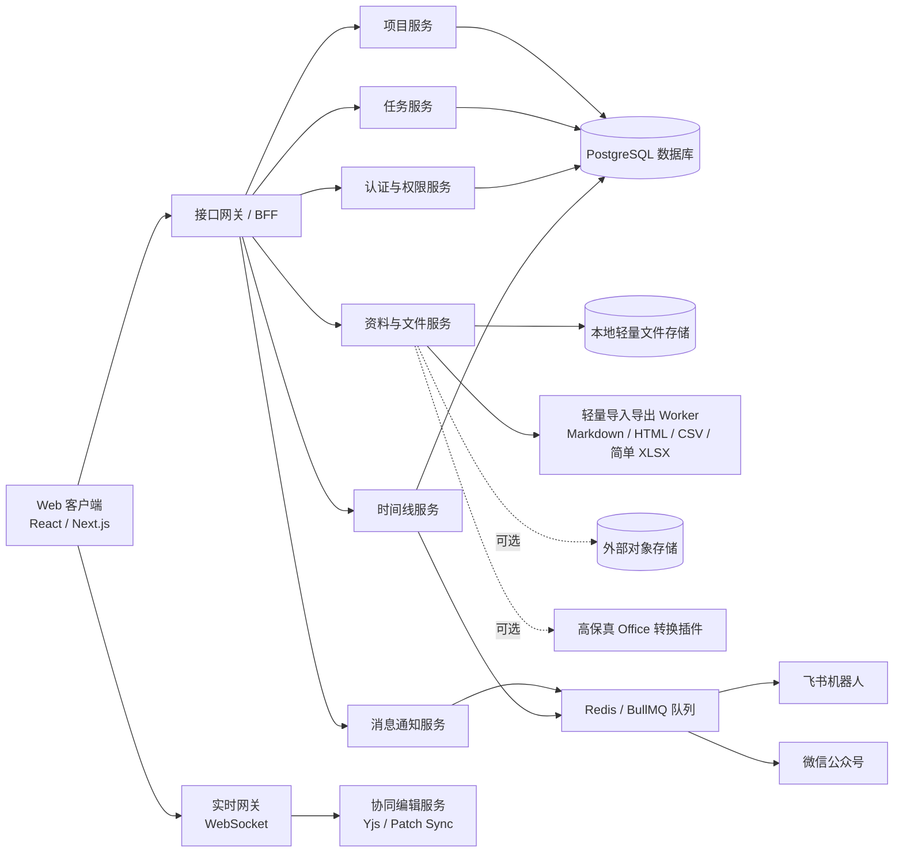

# LightTask v9 整体实现框架

## 总体架构



## VPS 配置预估

以下预估按 Docker Compose 或轻量容器部署计算，包含 Web/BFF、WebSocket、任务队列、PostgreSQL、Redis、轻量 Worker 和基础文件服务。v9 核心版不包含表格转储、大批量数据迁移和本机高保真 Office 转换，因此可以支持 2 核 2G 40G 的低配安装。

### 配置建议

| 场景 | 适用规模 | 推荐配置 | 说明 |
| --- | --- | --- | --- |
| 极简安装 | 1-5 人演示或轻量试用，少量项目 | 2 vCPU / 2GB RAM / 40GB SSD | 正式支持核心版安装；保留轻量文档/表格协同，关闭表格转储和高保真 Office 转换。 |
| 开发 / 演示 | 1-10 人测试，少量文档 | 2 vCPU / 4GB RAM / 60GB SSD | 可跑前后端、PostgreSQL、Redis 和轻量 Worker，体验更余裕。 |
| MVP 小团队 | 10-30 人，5-10 人同时在线协作 | 4 vCPU / 8GB RAM / 120GB NVMe SSD | 推荐起步配置，可承载项目、任务、时间线、消息和轻量文档协同。 |
| 小型生产 | 30-100 人，10-30 人同时协作 | 8 vCPU / 16GB RAM / 200-300GB NVMe SSD | 建议数据库、队列和 Worker 做资源限制；附件较多时走对象存储。 |
| 中型团队 | 100-300 人，50+ 人同时协作 | 拆分部署 | App 2 台 4c8g；DB 4-8c16-32g；Redis 2c4g；文件/对象存储独立；高保真转换插件按需另配。 |

### 2 核 2G 40G 低配安装模式

该模式目标是“可安装、可登录、可创建项目、可跑核心协作流程和轻量文档/表格协同”。它是正式支持的极简部署档，但不是高并发生产配置。

建议服务取舍：

- 启用：Web 客户端、BFF/API、WebSocket、PostgreSQL、Redis、轻量 Worker。
- 启用：项目、任务、甘特、成员、权限、时间线、消息规则。
- 启用：轻量 Word 风格文档编辑、轻量表格编辑、评论、多人光标、版本快照。
- 启用：轻量导入导出，例如 Markdown、HTML、CSV、简单 XLSX。
- 可选外置：附件对象存储，使用 S3/OSS/COS 或独立 MinIO。
- 关闭：表格转储、大批量数据迁移、本机 OnlyOffice / LibreOffice 转换。
- 后置：复杂 Office/WPS 高保真兼容、批量导入导出、全文索引、复杂图表和数据透视表。

建议限制：

- 并发在线用户：1-5 人。
- 同时协同编辑：1-3 人。
- 单文件上传：建议限制 10-20MB。
- 本地附件存储：建议不超过 10GB；团队资料较多时迁移对象存储。
- PostgreSQL、Redis、上传目录必须做每日备份。

系统优化建议：

- 开启 2-4GB swap 或 zram，避免 Node/数据库短时峰值导致 OOM。
- PostgreSQL 降低 `shared_buffers`、`work_mem`、`max_connections`，连接数建议不超过 30。
- Redis 设置内存上限，例如 256-384MB，并开启合理淘汰策略。
- Node.js 服务设置内存上限，例如 `--max-old-space-size=512`。
- Worker 并发设为 1，轻量导入导出任务排队执行。
- 前端构建尽量在本地或 CI 完成，VPS 只部署构建产物，减少安装时内存压力。
- 日志保留 7-14 天，审计日志定期归档，避免 40GB 磁盘被日志吃满。

### 单机 MVP 推荐

如果先搭一套可用版本，推荐从 `4 vCPU / 8GB RAM / 120GB NVMe SSD / 10-20Mbps 带宽` 起步。

该配置适合：

- 项目、任务、甘特、时间线、权限和消息同步。
- 轻量文档协同，少量并发编辑。
- 表格基础编辑、CSV/简单 XLSX 导入导出小文件。
- 飞书机器人和微信公众号提醒。

需要注意：

- 如果后续接入高保真 Office 转换插件，建议至少 `8 vCPU / 16GB RAM` 或单独部署转换节点。
- 如果附件较多，不建议把文件长期放在 VPS 本地磁盘，优先使用 S3/OSS/COS/MinIO 独立存储。
- PostgreSQL 建议预留独立数据盘和每日备份；生产环境不要只依赖 VPS 快照。
- WebSocket 协同编辑需要稳定网络，带宽和延迟比普通后台系统更敏感。

### 推荐部署拆分

第一阶段可以单机：

```text
Nginx/Caddy + Next.js/BFF + WebSocket + Worker + PostgreSQL + Redis
```

2 核 2G 40G 机器使用低配安装模式：

```text
Nginx/Caddy + Next.js/BFF + WebSocket + PostgreSQL + Redis + 轻量 Worker
关闭表格转储和本机 Office 高保真转换；Worker 单并发；附件可本地小容量或外置对象存储
```

进入生产后建议拆成：

```text
应用节点：Next.js/BFF/WebSocket
数据节点：PostgreSQL
队列缓存：Redis/BullMQ
可选转换节点：高保真 Office 转换插件
文件节点：本地文件服务或对象存储 + CDN
```

## 前端框架

建议技术栈：

- React / Next.js。
- TypeScript。
- Tailwind CSS 或 CSS Modules + CSS Variables。
- Radix UI / shadcn/ui 作为无障碍基础组件来源。
- Zustand 或 Jotai 管理界面状态。
- TanStack Query 管理服务端数据缓存。
- Framer Motion 或 CSS transition 管理菜单、侧栏和皮肤切换动效。
- 虚拟列表用于长任务、长日志、成员列表和表格行列。

### 前端目录建议

```text
src/
├─ app/
│  ├─ dashboard/
│  ├─ projects/
│  ├─ assets/
│  ├─ messages/
│  └─ admin/
├─ components/
│  ├─ shell/
│  ├─ navigation/
│  ├─ timeline/
│  ├─ gantt/
│  ├─ editor-doc/
│  ├─ editor-sheet/
│  └─ permissions/
├─ features/
│  ├─ dashboard/
│  ├─ projects/
│  ├─ tasks/
│  ├─ assets/
│  ├─ notifications/
│  ├─ themes/
│  └─ access-control/
├─ lib/
│  ├─ api/
│  ├─ realtime/
│  ├─ assets/
│  ├─ permissions/
│  ├─ theme/
│  └─ formatters/
└─ styles/
   ├─ tokens.css
   ├─ themes.css
   └─ motion.css
```

## 编辑器实现

### 项目资料：在线文档

推荐路线：

- 编辑核心：TipTap / ProseMirror 生态。
- 实时协同：Yjs + Hocuspocus 或自研 WebSocket 同步层。
- 评论：基于 mark / decoration 与评论线程表关联。
- 版本：定期快照 + 关键操作手动版本 + Yjs update 归档。
- 导入导出：Markdown、HTML、简单 docx 导入；Markdown、HTML、浏览器打印 PDF 导出。

关键要求：

- 工具栏必须图标化。
- 编辑器框体、工具栏、状态栏视觉上要是一体。
- Markdown 快捷输入是补充能力。
- 文档变更、评论、版本回滚要写项目时间线。
- 第一版不追求完整 Word 替代和高保真 docx 转换，只保留项目协作高频能力。

### 项目资料：在线表格

推荐路线：

- 表格核心：Univer 或同类在线表格引擎。
- 实时协同：单元格 patch、操作队列、服务端版本号和冲突恢复。
- 导入导出：CSV、简单 XLSX，保留基础单元格值、基础公式和常见样式。
- 表格性能：限制单表规模，使用行列虚拟化和单 Worker 排队处理轻量导入导出。

关键要求：

- 工具区全部图标化。
- 公式栏固定。
- 支持多人选区、评论、单元格历史和版本回滚。
- 表格导入导出只做轻量兼容提示，不做高保真兼容报告。
- 第一版不追求完整 WPS/Excel 替代，复杂图表、宏和数据透视表后置。

## 后端服务

建议拆分为模块化单体起步，接口边界按服务划分，后期再按压力拆微服务。

核心模块：

- Auth Module：登录、会话、用户、角色。
- Admin Module：用户管理、权限配置、服务器健康状态、通知 Key 状态。
- Project Module：项目、成员、项目设置、验收、归档。
- Task Module：任务、依赖、进度、甘特。
- File Module：附件、本地文件存储、预览、轻量导入导出。
- Doc Module：文档元数据、版本、评论。
- Sheet Module：表格元数据、版本、单元格操作。
- Timeline Module：项目时间线。
- Notification Module：飞书、微信、规则、模板、发送日志。
- Audit Module：系统审计。
- Theme Module：个人主题、全局主题变量。

## 数据模型核心表

```text
users
roles
user_roles
projects
project_members
project_acceptance_items
project_archives
tasks
task_dependencies
project_files
documents
document_versions
document_comments
sheets
sheet_versions
sheet_comments
timeline_events
notification_channels
notification_rules
notification_logs
audit_logs
theme_preferences
```

## 权限模型

采用 RBAC + ABAC：

- RBAC 管理角色基础能力。
- ABAC 判断资源归属、项目成员关系、文档分享范围、文件级权限。
- 项目创建者默认拥有该项目完整管理权。
- 超级管理员拥有跨项目查看与系统管理能力。
- 所有敏感操作先鉴权，再写审计，再执行业务。

## 事件与时间线

业务事件统一进入事件中心：

```text
task.created
task.updated
task.status_changed
task.schedule_changed
project.member_invited
project.permission_changed
project.acceptance_started
project.acceptance_approved
project.archived
file.uploaded
file.imported
document.updated
document.version_restored
document.comment_created
sheet.cell_changed
sheet.version_restored
notification.sent
notification.failed
```

每个事件可驱动三件事：

- 写入项目时间线卡片。
- 写入系统审计日志。
- 命中规则后触发消息提醒。

## API 设计方向

- `POST /auth/login`
- `POST /auth/logout`
- `GET /auth/me`
- `GET /dashboard/summary`
- `GET /dashboard/gantt`
- `GET /projects`
- `POST /projects`
- `GET /projects/:projectId`
- `POST /projects/:projectId/acceptance/start`
- `POST /projects/:projectId/acceptance/approve`
- `POST /projects/:projectId/archive`
- `POST /projects/:projectId/tasks`
- `GET /projects/:projectId/timeline`
- `POST /projects/:projectId/members/invite`
- `POST /projects/:projectId/files`
- `POST /projects/:projectId/documents`
- `GET /documents/:documentId`
- `POST /documents/:documentId/export`
- `POST /documents/:documentId/restore-version`
- `POST /projects/:projectId/sheets`
- `GET /sheets/:sheetId`
- `POST /sheets/:sheetId/export`
- `POST /notification-rules`
- `GET /notification-logs`
- `GET /admin/users`
- `POST /admin/users`
- `PATCH /admin/users/:userId`
- `GET /admin/health`
- `GET /admin/notification-keys`
- `POST /admin/notification-keys/feishu/test`
- `POST /admin/notification-keys/wechat/test`
- `GET /permissions/matrix`

## 轻量导入导出任务

轻量导入导出走异步任务，但不包含表格转储、大批量数据迁移或高保真 Office 转换：

1. 用户上传文件或发起导出。
2. 创建任务记录并进入队列。
3. 轻量 Worker 处理 Markdown、HTML、CSV、简单 XLSX 等格式。
4. 生成预览、轻量兼容提示和可下载文件。
5. 完成事件进入项目时间线。
6. 命中规则后发送提醒。

## 安全与稳定性

- 文件上传限制大小和类型。
- 下载链接使用短期签名。
- 分享链接支持过期时间和访问范围。
- 轻量导入导出任务幂等。
- 消息发送使用重试和死信队列。
- 协同连接需要心跳和断线恢复。
- 版本回滚需要二次确认并保留回滚前版本。

## 开发阶段建议

### 第一阶段

完成项目、任务、甘特、成员、基础权限、时间线、待处理队列和项目验收/归档。

### 第二阶段

接入项目资料中的在线文档，完成多人协同、评论、版本、轻量导入导出基础能力。

### 第三阶段

接入项目资料中的在线表格，完成公式栏、筛选、冻结、轻量导入导出和多人选区。

### 第四阶段

完成飞书机器人、微信公众号、关键规则、发送日志和失败重试。

### 第五阶段

完善审计、安全、性能、移动端适配、可访问性和管理员运维监控。
